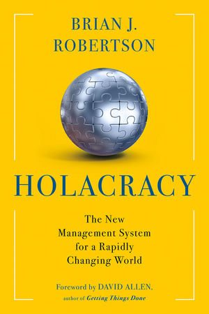
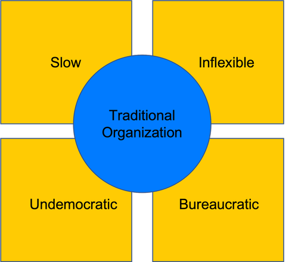
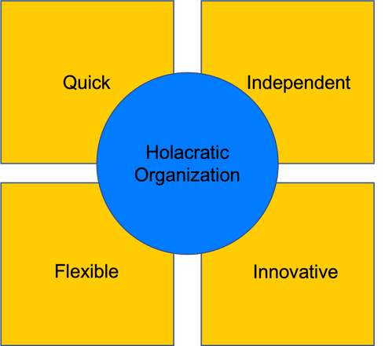
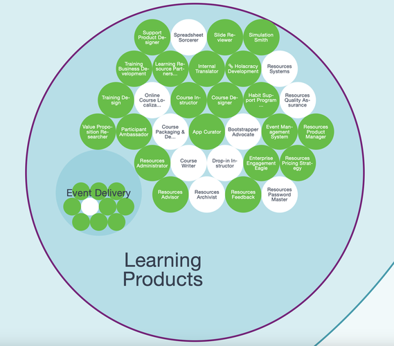
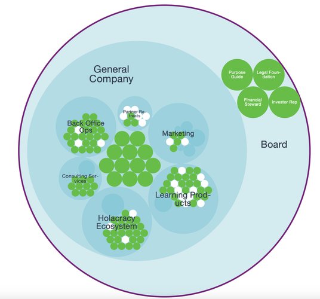

# Holacracy

NOTES FOR PRESENTATION

---

Bryan Salas

Digital Organisation SS2023

Prof. Dr. Ulrich Anders

May 10 2023

---

 **AGENDA** 

1. Definition
2. Background
3. Holacracy Constitution
4. Company Examples
5. Benefits
6. Limitations

---

 **WHAT IS HOLACRACY?** 

The concept of self-organization

Provides _autonomy_, _flexibility_ and _agility_ to the management structure of organizations

---

 **WHAT IS HOLACRACY?** 

Self organizing management style

Prominent characteristics include Circles, Roles, Tactical Meetings, Flat Hierarchies

Tool for agile management

Patented by Holacracy One

---

 **BACKGROUND** 

Created by Brian Robertson in 2007

---

 **PROBLEMS** 

---

 **HIS SOLUTION?** 

---

 **HOW IS HOLACRACY IMPLEMENTED?** 

Holacracy Constitution v5.0 from 2022

---

 **ROLES** 

Processes or constructs which can be filled by one or more individuals to achieve a goal or complete a task.

People can fill multiple roles at the same time.

---

 **ROLE LEADS** 

Responsible for fulfilling the roles' functions such as purpose and accountabilities.

Must track progress, break down projects and execute action stages

---

 **DOMAINS** 

Assets which one fulfilling a role can impact or utilize in order to fulfill their role and scope

---

 **CIRCLES** 

Collections of roles and policies with overarching functions in the organization.

Facilitators and secretaries synchronize and manage cohesion.

Can be sub divided into sub-circles.

---

 **SUPER CIRCLES** 

Circles can also be grouped together and be part of larger circles.

Comparable to departments in traditional organizations.

---

 **TACTICAL MEETINGS** 

The agile planning stage of Holacracy.

Cross-departmental communication across circles or within.

Objectives and progress reports are set through these meetings.

---

 **AUTHORITY DISTRIBUTION** 

Autonomy and Delegation are important to Holacracy.

Constraints, Interpretation and Initiative.

Set parameters for policies which individuals must follow.

---

 **GOVERNANCE** 

Led by Circle Representatives.

Used to amend, implement or repel policies and to provide guidance to roles and circles.

Distributes accountability and responsibility.

---

Example provided by Holacracy One

---

Example provided by Holacracy One

---

 **COMPANY EXAMPLES** 

David Allen Company - Restructuring

Zappos - Creativity

Mercedes-Benz IO - Innovation

---

Owner, David Allen, relinquished control for survivability of company

Getting things done - Productivity systems

Implemented to resolve internal hierarchical problems

---

Former CEO, Tony Hseih wanted to increase creativity

Wanted to be more flexible to demands in e-commerce

Most famous adopter of Holacracy

---

Holacratic re-branding in 2021

Self organizing at all levels

Response to COVID-19, Electric Vehicles and Aftersales Services

---

 **BENEFITS** 

Adaptable to market conditions and agile

Provides employees with autonomy

Useful in post covid digital age

Constant evolution

---

 **LIMITATIONS** 

Difficult to apply to high power distant cultures

Disruptive implementation

Management support needed

## Specific conditions must be met

## What?

What problem is Holacracy solving?

##### Inefficiency in firms

Solves business processes by increasing delegation and responsibilities
Removes the pressure and burden which may be placed on one boss or person responsible
Some workers are given autonomy to solve tasks by themselves instead of waiting or going for approval

#### Provides Focus and Purpose

Employees are given a voice in Holacracy. Regular hierarchies in organizations are often tall and top down. In order to achieve change, people would need to build consensus among employees and higher management, as well as deal with corporate politics. This creates a relatively slow process of decision making and slows down processes of change. Holacracy is not consensus based but rather recommendation based.

Some employees may become dissatisfied with their jobs after sometime due to various reasons, Holacracy offers employees various growth opportunities and to work on tasks and purposes which they are personally interested in or passionate about. Holacracy does not have traditional job titles but instead transforms departments into circles and sub circles which employees can conduct business operations within their circles, employees are given roles within these circles and can partake or be part of a number of different circles simultaneously. Their roles or positions in the hierarchy within the circle may be different to best suit their strengths, this gives employees increased autonomy and accountability for the work they perform.

#### Flattens hierarchies

Reduces hierarchies and bureaucracy increasing the speed in which tasks can be performed. It seeks to reorganize the company structure by providing people with roles rather than positions, in this roles employees will be able to work faster due to the increased autonomy and independence they gain. This also helps to reduce wastefulness that may arise from consensus building or corporate politics.

---

## Why?

#### How did Holacracy come about?

Holacracy came as a result of bureaucratic problems which mainly stemmed off from having tall hierarchies in corporations. Holacracy permits the reduction of these barriers on lower levels which allows subordinates or business processes to act faster and more independently from one another.

The term was originally coined and created by Brian J. Robertson under the company HolacracyOne, which formulated the process. It is best described by him and David Allen as a self organizing organization, meaning that the organization is in a constant stage of evolution within market forces.

There has also been a generational and cultural shift in the younger workforce primarily in Western countries than others, in which younger people prefer to work in more democratic and meaningful organizations with a purpose, and often want to be given a voice in the decision making process. Because of this trend and change in preferences, Holacracy can become a new an attractive alternative for companies who want to foster a new working culture in organizations or countries where the population is aging and attracting new and younger talent can be a challenge.

Holacracy as mentioned before has its own evolutionary purpose, meaning that the organization's culture and purpose is always changing due to the nature of the self-managing organization. This makes Holacracy a great tool for companies that are struggling with creating and building a convincing or concrete corporate culture. It also helps with change management as the change which occurs in a company which partakes in Holacracy is always gradual meaning that change is always happening, this would mainly benefit companies which primarily need innovation or creativity as their main focus of business operations. Radical change would not be possible under Holacracy.

--

## How?

Notes

How is it used and how successful is it really?

david Allen describes it as:
organization
self organizing
no need for central leaders or power,
freedom and creative structure
allows everyone to be able to shape and create the corporate culture

clearer tasks and goals
increased autonomy and independence
creative industries benefit the most

fulfill agreements and roles

structure

departments/circles
purposes
roles have accountability
output
no official titles just roles
not a top down organization

the organization has its own evolutionary purpose meaning that the companies purpose and propositions will change with time and with market forces

the higher purpose of the organization matters the most than personal gain
works better if those with power are able to relinquish it like David Allen

increased trend in the west towards flatter hierarchies, increase of democratization and egalitarianism in the workforce

propose to get authority to act on own terms
based on incremental improvements
democratic leadership style
everyone gets a voice, relies on suggestions rather than consensus
distribution of leadership at all levels
everyone involved in improvement and decision making of business operations at all levels

---

## Zappos

Notes

Holacracy was popularized by [Zappos](https://www.zappos.com/about/how-we-work)

Zappos when

Holacracy

CEO Tony Hsieh clarified that Holacracy at Zappos meant:
hierarchy of people
hierarchy of purpose with holacracy
purpose for the company - general company circle
circles fulfill purpose
within the circle there are roles and sub circles and repeats down

hierarchy of circle,
one person may fill roles in different circles that each have different purposes

hierarchy still remains but the hierarchy may be different in another circle
one may lead one circle but be of lower status in another

allows employees to be involved in different areas of the company
goal is for employee self fulfillment - finding what they are passionate about and what they are good at and what will benefit the company

role assignment within circles
managers of sub circles can decide who to offer roles to and who does what
add to a role or remove from a role, no hiring or firing - no hiring or firing costs for the organization, this allows for improved workforce mobilization across the company, which reduces turnover rate

---

## Criticisms of Holacracy

Zappos and other firms, originally became famous implemented Holacracy and their role and task based work positions, however they came under criticism regarding Holacracy.

Many argue that Holacracy is somewhat difficult to implement in the average organization.
As creating self autonomous circles or units may not be able to coordinate much with each other.

Some also claim the process is also rather complex, and argue that Zappos has not seen overly positive nor beneficial results.

---

## Image Sources

Taken from the [Zappos Press Kit](https://www.zappos.com/about/press-kit)

---

Taken from the [Holacracy Press Kit](https://www.holacracy.org/press-kit)

---

## Summary - [Constitution from the Holacracy website](https://www.holacracy.org/constitution/5)

TAKEN DIRECTLY FROM THE HOLACRACY WEBSITE
read and summarize most important points
search up more on points on the circles, contracts and obligations are most important
